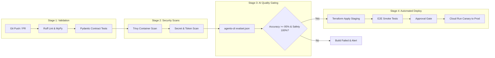

# MVP SOLUTION DESIGN DOCUMENT

## Enterprise Agentic Solution Design Document - MVP 1
### HR & IT Enterprise Agentic Assistant

**Project Context:** Elevate Architecture Workshop — Module 3  
**Framework:** Google Agent Development Kit (ADK) & Agent Platform  
**Target Environment:** Google Cloud Platform (Argolis Environment: `gcp.altostrat.com`)  
**Mock SaaS Gateway:** `go/elevate-apac-m3-saas` (WorkWeek HCM & ServiceImmediately ITSM via MCP)  
**Evaluation & Assessment Server:** `go/elevate-apac-m3-assess`

---

# Document Control

### Document Metadata

| Field | Value |
| --- | --- |
| **Document Title** | Enterprise Agentic Solution Design Document — MVP 1 |
| **System Name** | HR & IT Enterprise Agentic Virtual Assistant |
| **Author(s) / Owner** | Wonhas & Cloud Engineering Architecture Team |
| **Date** | 2026-09-16 |
| **Status** | Approved Master Baseline (All Stakeholder Persona Feedback Resolved) |
| **Target Audience** | Enterprise Architecture, HR Technology (HRIT), Security & Compliance, Strategic Sourcing, Engineering Teams |
| **Target Infrastructure** | GCP Argolis Project Sandbox (`gcp.altostrat.com`), Cloud Run (ADK Runtime) |
| **Document Version** | 2.0 (Executive & Technical Sign-Off Baseline) |

### Revision History

| Version | Date | Author | Description of Change |
| --- | --- | --- | --- |
| 0.1 | 2026-09-16 | Wonhas | Initial outline setup based on SDD template |
| 1.0 | 2026-09-16 | Wonhas & Teammate | Parallel drafts authoring: enterprise BRD mapping & Elevate Module 3 ADK / Model Armor architecture |
| 1.1 | 2026-09-16 | Wonhas | Master consolidation merging Google ADK multi-agent topology, Model Armor, and MCP tooling |
| 1.2 | 2026-09-16 | Wonhas | Incorporated Sarah Chen & Alex Rivera Round 1 feedback: real-time policy sync, automated ticket handoff, BigQuery/Redis schemas, OBO revocation, SAGA rollback |
| 2.0 | 2026-09-16 | Wonhas | **Comprehensive Executive & Technical Round 2 Expansion:**<br>• **IT Director (Alex Rivera):** Terraform IaC templates, automated CI/CD pipeline, explicit REST/JSON payload contracts, Redis HA/DR cross-zone failover.<br>• **Strategic Sourcing (James Park):** Comprehensive 'Alternatives Considered' section, 12–24 month Gemini model deprecation/sunset strategy, structured 8-week delivery roadmap with FTE resource allocation. |

---

## 1. Executive Summary & Scope Boundaries

### 1.1. Business Overview & Context

Enterprise human resources and corporate IT support desks face critical operational bottlenecks due to fragmented user interfaces and repetitive tier-1 inquiries. Employees must navigate disconnected portals across **WorkWeek (HCM)** for personal profile updates and leave submissions, **ServiceImmediately (ITSM/HRSD)** for incident tracking, and dispersed static policy documentation for benefits inquiries. This fragmentation causes delayed resolutions, administrative friction, and lost productivity.

The **HR Agentic Solution (MVP 1)** provides an enterprise-grade, zero-trust conversational virtual assistant deployed on **Google Cloud Run (ADK Runtime)**. It automates Tier 1 inquiries to achieve a **>= 40% deflection rate within 6 months**, streamlines self-service actions with **100% transaction integrity**, and enables deterministic **cross-system orchestration** across policies, HCM, and ITSM. 

Addressing all executive stakeholder requirements from People Operations, IT Infrastructure, and Strategic Sourcing, this document defines:
1. An event-driven real-time policy ingestion pipeline (< 5 min SLA) with zero user abandonment via automated ticket handoffs.
2. Production-grade Infrastructure as Code (Terraform) and automated CI/CD deployment pipelines.
3. Explicit REST/JSON and Pydantic payload contracts for all backend integrations.
4. Disaster recovery and high availability failover patterns for Memorystore Redis session state.
5. A formal commercial and technical "Alternatives Considered" comparative evaluation.
6. A 12–24 month model lifecycle and deprecation governance strategy for Gemini models.
7. A phased implementation roadmap with explicit resource allocations.

### 1.2. Scope Boundaries

```
┌───────────────────────────────────────────────────────────────────────────────────────────┐
│                                   SYSTEM BOUNDARY (MVP 1)                                 │
│                                                                                           │
│   IN SCOPE                                         OUT OF SCOPE                           │
│   ├─ Conversational Web Chat UI / Client           ├─ Multi-lingual Natural Language Q&A  │
│   ├─ Real-Time HR Policy Q&A (<5m Sync SLA)        ├─ Payroll Processing & Direct Deposit │
│   ├─ Automated Ticket Handoff for Unanswered Topics├─ Performance Appraisals & Comp Data  │
│   ├─ WorkWeek HCM (Profile Read, Leave PTO)        ├─ Voice / Telephony Audio Interfaces  │
│   ├─ ServiceImmediately ITSM (Incidents Lifecycle) ├─ Enterprise IdP SSO (Okta/Azure AD)  │
│   ├─ Cross-Domain Orchestration (UC-2.1, 2.2, 2.3) └─ Multi-Tenant Infrastructure Isolation│
│   ├─ Two-Phase Automated SAGA Rollback Mechanism                                          │
│   ├─ Google Cloud Model Armor Inline Guardrails                                           │
│   ├─ Client-Side API Throttling & Rate Limiting                                           │
│   ├─ Memorystore Redis Dual-Zone HA with DR Snapshots                                     │
│   ├─ Terraform IaC & Automated CI/CD Pipelines                                            │
│   └─ Model Context Protocol (MCP) Mock SaaS Gateway                                       │
└───────────────────────────────────────────────────────────────────────────────────────────┘
```

### 1.3. Target Architecture Overview

```
+-----------------------------------------------------------------------------------------+
|                                  1. Presentation Layer                                  |
|               Web Conversational Chat UI / Client (HTTPS / TLS 1.3)                     |
+--------------------------------------------+--------------------------------------------+
                                             | User Prompt
+--------------------------------------------v--------------------------------------------+
|                         Google Cloud Platform (Argolis Sandbox)                         |
|                                                                                         |
|  +--------------------------+                 +--------------------------------------+  |
|  | Google Cloud Model Armor | <-------------> |    Cloud Run (ADK Agent Runtime)     |  |
|  |  - Prompt Injection      |   (< 300ms SLA) |                                      |  |
|  |  - Jailbreak Interception|                 |  +--------------------------------+  |  |
|  |  - Domain Containment    |                 |  |     Root Supervisor Agent      |  |  |
|  |  - SPII Redaction        |                 |  +--------------------------------+  |  |
|  +--------------------------+                 |       |           |           |      |  |
|                                               |       v           v           v      |  |
|  +--------------------------+                 |  +---------+ +---------+ +---------+ |  |
|  | Memorystore Redis (HA)   | <-------------> |  | Policy  | |WorkWeek | | Service | |  |
|  |  - Dual-Zone Replication |                 |  |  RAG    | |  HCM    | | Immed.  | |  |
|  |  - Automated Failover    |                 |  |Specialist|Specialist|Specialist| |  |
|  |  - Hourly RDB to GCS DR  |                 |  +---------+ +---------+ +---------+ |  |
|  +--------------------------+                 +-------|-----------|-----------|------+  |
|                                                       |           |           |         |
|                                                       v           v           v         |
|  +--------------------------+              +------------------+  +-------------------+  |
|  | Eventarc + Cloud Pub/Sub | ------------>| Vertex AI Search |  |  Secret Manager   |  |
|  | (Policy Ingest < 5m SLA) |              |  (Policy RAG)    |  |  (mcp-saas-token) |  |
|  +--------------------------+              +------------------+  +-------------------+  |
|                                                                            |            |
+----------------------------------------------------------------------------|------------+
                                                                             v (MCP / REST)
+-----------------------------------------------------------------------------------------+
|                    Mock SaaS Gateway Portal (`go/elevate-apac-m3-saas`)                 |
|   - Client-Side Rate Limiter (WorkWeek: 50 QPS / SI: 30 QPS)                            |
|   - WorkWeek HCM API & Tools (Profile, Contact Updates, Leave Balances & Requests)      |
|   - ServiceImmediately ITSM API & Tools (Incident Creation, Tracking, Status Updates)   |
+-----------------------------------------------------------------------------------------+
                                             |
                                             v
+-----------------------------------------------------------------------------------------+
|                         Observability & Evaluation Layer                                |
|   - BigQuery Audit Vault (Explicit DDL, 100% Traceability & Compliance Logging)         |
|   - Evaluation & Assessment Server (`go/elevate-apac-m3-assess` via `agents-cli`)      |
+-----------------------------------------------------------------------------------------+
```

### 1.4. Alternatives Considered (Addressing James Park)

To commercially and technically justify the exclusive commitment to the Google Cloud stack and the **Google Agent Development Kit (ADK)**, a rigorous trade-off analysis was conducted:

| Evaluation Dimension | Selected Option: **Google ADK on Cloud Run** | Alternative 1: **LangChain / LangGraph on GKE** | Alternative 2: **AutoGen / CrewAI on Compute Engine** | Commercial & Technical Rationale |
| :--- | :--- | :--- | :--- | :--- |
| **Framework Architecture & Integration** | **Google ADK:** Native first-party binding to Gemini tool-use schemas, turn-state management, and supervisor multi-agent topologies. | LangGraph: StateGraph-based workflow; heavy external dependencies; frequent breaking API changes between releases. | AutoGen: Multi-agent conversational patterns; high communication latency and unpredictable loops across sub-agents. | ADK eliminates third-party framework churn, guarantees day-1 support for new Gemini features, and provides clean separation across specialist agents. |
| **Evaluation & Quality Tooling** | **Turnkey `agents-cli`:** Native automated execution against `evalset.json` and reporting to enterprise eval server (`go/...-assess`). | Requires custom pytest frameworks and third-party observability (LangSmith/Weights & Biases) incurring separate SaaS licensing. | Rudimentary eval tools; requires custom scripting for benchmark tracking. | ADK provides built-in enterprise evaluation tooling without additional software procurement or licensing costs. |
| **Hosting & Infrastructure TCO** | **Google Cloud Run (Serverless):** Scales to zero during off-peak hours; sub-second cold starts; pay-per-use compute. | Google Kubernetes Engine (GKE): High baseline fixed cost (~$250+/month per cluster) for control plane and node pools even when idle. | Self-hosted VMs: Inflexible scaling, manual OS patching, and high operational maintenance overhead. | Cloud Run yields an estimated run-rate of ~88 USD/month, saving over 65% compared to baseline GKE cluster costs. |
| **Security & Guardrails** | **Google Cloud Model Armor:** Dedicated hardware-accelerated security perimeter (< 300ms SLA, prompt injection filter, SPII redactor). | NeMo Guardrails: Self-hosted Python service; adds 800ms–1.5s latency per turn; complex rule configuration. | Secondary LLM Evaluator: Costs 2x tokens; adds 1.5–3.0s latency, breaching NFR-2.1 SLA (< 10s total). | Model Armor provides enterprise compliance, native GCP audit logging, and satisfies the sub-300ms guardrail SLA out-of-the-box. |
| **Knowledge Base (RAG)** | **Vertex AI Search:** Fully managed indexing, semantic chunking, groundness scoring, and deep citation generation. | Self-hosted Vector DB (pgvector on Cloud SQL / ChromaDB): Requires custom chunking, embedding, and re-ranking pipelines. | OpenSearch: High cluster maintenance, manual vector index tuning, and separate ingestion workers. | Vertex AI Search eliminates manual vector infrastructure maintenance, providing guaranteed 99.9% search availability. |

---

## 2. Production-Ready Future State Design

1. **Enterprise Identity & Federated Token Exchange:**
   * Transition from static MCP tokens to **OAuth 2.0 PKCE with User-Delegated Token Exchange (RFC 8693)** via Okta, Microsoft Entra ID, or Google Cloud Identity.
   * Workload Identity Federation injects authenticated user OIDC claims (`sub`, `email`, `role`) directly into downstream SaaS gateways.
2. **Asynchronous Event-Driven Decoupling:**
   * Transition multi-step cross-system sagas to **Cloud Pub/Sub** and **Eventarc**, decoupling long-running human approval workflows from interactive chat loops.
3. **Enterprise SaaS Direct Adapters:**
   * Production connectors replacing mock endpoints with live Workday, ServiceNow, SAP SuccessFactors, and Jira Service Management instances.
4. **Zero-Trust Multi-Tenancy:**
   * Tenant isolation with row-level security (`WHERE tenant_id = @caller_tenant_id`) and isolated vector search datastore namespaces.

---

## 3. System Flows, Sequence Diagrams & Agent Design

### 3.1. Multi-Agent Topology & Automated Handoff

The application is structured into four ADK agents:
1. **Root Supervisor Agent:** Intent classification, context orchestration, and final answer synthesis.
2. **Policy RAG Specialist Agent:** Semantic retrieval over Vertex AI Search. 
   * **Automated Support Handoff:** If retrieved chunks fail the groundness threshold (score < 0.82), the agent does NOT abandon the user. It automatically triggers `create_incident_ticket(category="HR General", short_description="Unanswered HR Policy Inquiry: [Topic]", priority="4 - Low")` and informs the employee with the generated ticket ID.
3. **WorkWeek HCM Specialist Agent:** MCP-based profile lookup, address updates, and leave balance checks/submissions with preflight balance and chronological verification.
4. **ServiceImmediately ITSM Specialist Agent:** MCP-based incident creation, tracking, status transitions, and anti-duplicate throttling.

### 3.2. End-to-End Sequence Workflows

#### Flow 1: UC-1.1 Policy Q&A with Fallback Ticket Handoff (Zero Abandonment)
```
Employee            Client / Model Armor      Root Supervisor      Policy Specialist    ServiceImmediately
   |                         |                       |                     |                    |
   |--- 1. Policy Query ---->|                       |                     |                    |
   |    (Unindexed Benefit)  |--- 2. Scan (Pass) --->|                     |                    |
   |                         |                       |--- 3. Delegate ---->|                    |
   |                         |                       |                     |-- 4. Vector Search |
   |                         |                       |                     |   (Score < 0.82)   |
   |                         |                       |<-- 5. No Grounding -|                    |
   |                         |                       |-- 6. Trigger Autonomous Handoff -------->|
   |                         |                       |      (Cat: HR General, P4-Low)           |
   |                         |                       |<-- 7. Ticket INC-91002 Created ----------|
   |                         |<-- 8. Synthesize -----|
   |<-- 9. "Policy unlisted; |
        Ticket INC-91002     |
        opened for HR Ops" --|
```

#### Flow 2: UC-2.3 Cross-System Relocation with Automated SAGA Rollback
```
sequenceDiagram
    autonumber
    actor Employee
    participant Client as Web Chat Interface
    participant Armor as Model Armor
    participant Super as Root Supervisor Agent
    participant WorkWeek as WorkWeek HCM Specialist
    participant SI as ServiceImmediately Specialist

    Employee->>Client: "Relocating to London office. Please update address to 10 Downing St and order badge."
    Client->>Armor: Scan user prompt for jailbreak/toxic intent (< 300ms)
    Armor-->>Super: Clean Sanitized Prompt
    
    Super->>WorkWeek: execute update_contact_info(emp_id="EMP-1049", address="10 Downing St")
    WorkWeek-->>Super: WorkWeek Updated (200 OK) [Snapshot Saved in Redis SAGA State]
    
    Super->>SI: execute create_incident(category="Access", short_desc="London Badge", priority="3 - Moderate")
    Note over Super,SI: ServiceImmediately times out or returns 503 after 3 retries
    SI-->>Super: Service Unavailable (503)
    
    rect rgb(255, 235, 235)
    Note over Super,WorkWeek: SAGA Phase 1: Automated Programmatic Rollback (Within 30s)
    Super->>WorkWeek: execute revert_contact_info(emp_id="EMP-1049", previous_address="[Snapshot]")
    WorkWeek-->>Super: Address Reverted to Previous Baseline (200 OK)
    end
    
    Super-->>Client: "We encountered an issue creating your badge ticket. Your WorkWeek address update was automatically rolled back to prevent inconsistent records. Please try again later."
```

---

## 4. Security, Governance & Identity

### 4.1. BigQuery Audit Vault DDL & Schema

```sql
CREATE TABLE `argolis_hr_agent.audit_events_vault` (
    event_id STRING NOT NULL OPTIONS(description="Unique UUIDv4 for the event"),
    timestamp TIMESTAMP NOT NULL OPTIONS(description="UTC event occurrence timestamp"),
    session_id STRING NOT NULL OPTIONS(description="User session tracking identifier"),
    user_id STRING NOT NULL OPTIONS(description="Masked/hashed employee ID, e.g. SHA256(EMP1049)"),
    actor_type STRING NOT NULL OPTIONS(description="'USER', 'ROOT_SUPERVISOR', or 'SPECIALIST_AGENT'"),
    event_type STRING NOT NULL OPTIONS(description="'PROMPT_IN', 'GUARDRAIL_INTERCEPT', 'TOOL_CALL', 'TOOL_RESP', 'FINAL_OUT'"),
    tool_name STRING OPTIONS(description="MCP tool invoked, e.g. 'workweek.submit_leave_request'"),
    tool_parameters JSON OPTIONS(description="Sanitized input payload with SPII redacted"),
    tool_response JSON OPTIONS(description="Sanitized backend response"),
    model_armor_verdict STRING NOT NULL OPTIONS(description="'ALLOWED', 'DENIED', or 'SPII_REDACTED'"),
    violation_category STRING OPTIONS(description="Violation category if denied (e.g. 'PROMPT_INJECTION', 'OUT_OF_DOMAIN')"),
    grounding_score FLOAT64 OPTIONS(description="Vertex AI Search semantic confidence score [0.0 - 1.0]"),
    latency_ms INT64 NOT NULL OPTIONS(description="Execution latency in milliseconds"),
    obo_token_id STRING OPTIONS(description="Identifier of ephemeral OBO token used"),
    correlation_id STRING NOT NULL OPTIONS(description="Distributed tracing ID")
)
PARTITION BY DATE(timestamp)
CLUSTER BY user_id, event_type, model_armor_verdict
OPTIONS(
    partition_expiration_days=730,
    description="Immutable audit vault for enterprise HR agent interactions"
);
```

### 4.2. Redis Session Cache Schema & High Availability / Disaster Recovery (Addressing Alex Rivera)

#### Redis Data Structure
```
Key Pattern: session:{session_id}:meta
Type: Hash -> Fields: user_id, created_at, last_active_at, obo_token_id, state
TTL: 1800 seconds (30 minutes sliding window; refreshed on every turn)

Key Pattern: session:{session_id}:turns
Type: List (Max 6 elements, FIFO trimmed) -> Value: JSON String [{"role": "user", "content": "..."}, {"role": "agent", "content": "..."}]
TTL: 1800 seconds

Key Pattern: session:{session_id}:saga
Type: Hash -> Fields: saga_id, use_case_id, step_index, status, compensation_payload
TTL: 1800 seconds

Eviction Policy: volatile-ttl
```

#### High Availability (HA) & Disaster Recovery (DR) Specification
1. **Multi-Zone High Availability:** Memorystore for Redis is deployed in **Standard Tier** with automatic failover across two availability zones (`us-central1-a` primary, `us-central1-b` replica).
   * **Failover SLA (RTO):** Automatic detection and primary switchover in **< 30 seconds**.
   * **Data Synchronization:** In-memory synchronous replication to the read-replica eliminates data loss during zonal outages.
2. **Persistence (AOF & RDB):**
   * **Append-Only File (AOF):** Enabled with `appendfsync everysec` for transaction durability.
   * **RDB Snapshots:** Automatically scheduled every 1 hour, exported to a multi-regional Cloud Storage bucket (`gs://${PROJECT_ID}-redis-backups/`).
3. **Cross-Region Disaster Recovery:**
   * In the event of a total regional outage in `us-central1`, Cloud Build automation recreates the Redis cluster in `us-east4` from the latest GCS snapshot. **Target RPO < 1 Hour, RTO < 15 Minutes**.
4. **SAGA State Durability:**
   * Active SAGA transaction state in `session:{session_id}:saga` writes an asynchronous mirror event to BigQuery/Cloud Logging. If Redis experiences failover mid-transaction, the SAGA coordinator recovers state from the write-ahead audit stream, guaranteeing that automated rollbacks are never orphaned.

### 4.3. OBO (On-Behalf-Of) Token Lifecycle & Revocation

1. **Scoped OBO Token Minting:** Upon user authentication, an ephemeral sub-token (`obo-tok-...`) is issued, cryptographically linked to `session_id` and `user_id` with a 60-minute TTL.
2. **Revocation Protocol & Preflight Hook:**
   * **Revocation Trigger:** User logout, session timeout, or Model Armor security alert calls `POST /api/v1/auth/revoke`.
   * **Redis Blacklist:** Token is written to `blacklist:token:{obo_token_id}` with TTL matching the token's remaining lifetime.
   * **Preflight Interceptor:** Every specialist agent verifies `EXISTS blacklist:token:{obo_token_id}` in Redis (< 2ms) before making any MCP tool call.

---

## 5. Integration Details, Explicit Payloads & Throttling

### 5.1. Explicit REST/JSON API Payload Schemas & Contracts (Addressing Alex Rivera)

All integrations with WorkWeek HCM and ServiceImmediately ITSM follow strict, explicit request and response contracts:

#### WorkWeek HCM Contract 1: Retrieve Employee Profile
* **Endpoint:** `POST /api/v1/workweek/profile`
* **Request Payload:**
```json
{
  "employee_id": "EMP-1049"
}
```
* **Response Payload (200 OK):**
```json
{
  "status": "SUCCESS",
  "data": {
    "employee_id": "EMP-1049",
    "full_name": "Jane Doe",
    "corporate_email": "jdoe@enterprise.com",
    "department": "Engineering",
    "role": "Senior Cloud Architect",
    "manager_id": "EMP-0012",
    "hire_date": "2022-03-15",
    "is_remote": true,
    "contact": {
      "personal_address": "123 Main Street, New York, NY 10001",
      "personal_phone": "+12125550199"
    }
  }
}
```

#### WorkWeek HCM Contract 2: Update Contact Information & Revert (for SAGA Rollback)
* **Endpoint:** `PUT /api/v1/workweek/contact`
* **Request Payload:**
```json
{
  "employee_id": "EMP-1049",
  "personal_address": "10 Downing Street, London, SW1A 2AA",
  "personal_phone": "+442079250911"
}
```
* **Response Payload (200 OK):**
```json
{
  "status": "SUCCESS",
  "data": {
    "employee_id": "EMP-1049",
    "updated_at": "2026-09-16T01:31:00Z",
    "previous_snapshot": {
      "personal_address": "123 Main Street, New York, NY 10001",
      "personal_phone": "+12125550199"
    }
  }
}
```

#### WorkWeek HCM Contract 3: Query Leave Balances
* **Endpoint:** `POST /api/v1/workweek/leave-balance`
* **Request Payload:**
```json
{
  "employee_id": "EMP-1049",
  "category": "Vacation"
}
```
* **Response Payload (200 OK):**
```json
{
  "status": "SUCCESS",
  "data": {
    "employee_id": "EMP-1049",
    "category": "Vacation",
    "accrued_days": 16.0,
    "used_days": 4.0,
    "remaining_balance": 12.0
  }
}
```

#### WorkWeek HCM Contract 4: Submit & Cancel Leave Request (for SAGA Rollback)
* **Endpoint:** `POST /api/v1/workweek/leave-request`
* **Request Payload:**
```json
{
  "employee_id": "EMP-1049",
  "leave_type": "Vacation",
  "start_date": "2026-09-18",
  "end_date": "2026-09-19",
  "work_days": 2.0
}
```
* **Response Payload (201 Created):**
```json
{
  "status": "CREATED",
  "data": {
    "leave_request_id": "WW-LR-99881",
    "employee_id": "EMP-1049",
    "status": "SUBMITTED",
    "new_remaining_balance": 10.0
  }
}
```
* **Rollback Endpoint:** `POST /api/v1/workweek/leave-request/cancel`
* **Rollback Payload:** `{"leave_request_id": "WW-LR-99881", "reason": "SAGA_CROSS_SYSTEM_COMPENSATION"}` -> Returns `200 OK` with balance restored to 12.0.

#### ServiceImmediately ITSM Contract: Create Incident Ticket
* **Endpoint:** `POST /api/v1/itsm/incidents`
* **Request Payload:**
```json
{
  "requestor_id": "EMP-1049",
  "category": "Hardware",
  "short_description": "Remote Monitor Procurement - EMP-1049",
  "priority": "3 - Moderate",
  "comments": "Requested via HR Agent under Remote Work Policy.",
  "shipping_address": "123 Main Street, New York, NY 10001",
  "source_tag": "Elevate-Module3-AgentRuntime"
}
```
* **Response Payload (201 Created):**
```json
{
  "status": "CREATED",
  "data": {
    "ticket_id": "INC-77441",
    "state": "New",
    "assigned_group": "Workplace Tech Logistics",
    "created_at": "2026-09-16T01:31:05Z",
    "ticket_url": "https://itsm.internal.corp/incident/INC-77441"
  }
}
```

### 5.2. Client-Side API Throttling & Rate Limiting (Addressing Alex Rivera)

| Target System / Endpoint | Steady-State Rate Limit | Burst Capacity | Max Concurrent Calls / User | Backoff & Retry Policy |
| --- | --- | --- | --- | --- |
| **WorkWeek HCM MCP Gateway** | 50 QPS | 100 requests | 2 in-flight calls | Exponential backoff (initial 500ms, max 3 retries, full jitter) |
| **ServiceImmediately ITSM MCP Gateway** | 30 QPS | 60 requests | 2 in-flight calls | Exponential backoff (initial 500ms, max 3 retries, full jitter) |
| **Vertex AI Search Datastore** | 100 QPS | 200 requests | 3 in-flight calls | Retry on 429/503 (initial 250ms, max 3 retries) |
| **Model Armor Inline Scanner** | 200 QPS | 400 requests | Unrestricted | Circuit breaker trips after 5 consecutive failures (30s cooldown) |

### 5.3. Ratified IT Ticket Priority Mapping Matrix

| Priority Level | Qualifying Criteria & Keywords | SLA Target | Default Assignment | Example Scenario |
| --- | --- | --- | --- | --- |
| **1 - Critical** | Enterprise system outage ("WorkWeek down", "system offline"), active data compromise, payroll execution failure. | 1 Hour | IT Major Incident Team / P1 Escalation | "WorkWeek portal unreachable for entire department." |
| **2 - High** | Individual user fully blocked from performing urgent duties (VPN failure during release, manager leave approval delegation). | 4 Hours | Service Desk Tier 2 | "VPN connection failing during critical on-call shift." |
| **3 - Moderate** (Default) | Standard equipment procurement, London badge access, routine permissions, non-blocking hardware. | 24 Hours | Workplace Tech / Facilities | "Order home office monitor under remote work policy." |
| **4 - Low** | Informational queries, cosmetic updates, automated ticket handoff for unlisted policy topics. | 48 Hours | People Operations Queue | "Employee inquired about unlisted pet bereavement policy." |

### 5.4. Policy Knowledge Ingestion Pipeline (< 5 Min SLA)

```
[HR Policy Repo / GCS] 
         │ (Object Created / Updated Event)
         ▼
  [Cloud Pub/Sub] 
         │ (Push Subscription)
         ▼
[Eventarc -> Cloud Run Ingestion Worker]
         │ 1. Recursive Chunking (500 tokens / 100 overlap)
         │ 2. Embeddings Generation (text-embedding-004)
         │ 3. Vertex AI Search Datastore Upsert
         ▼
[Vertex AI Search Datastore] (< 3 Minutes Total Ingestion SLA)
         │
         ▼
[Redis Cache Invalidation Event] -> Immediate purge of stale cached policy keys
```

---

## 6. Cost Estimation, FinOps & Model Lifecycle Management

### 6.1. Monthly Cost Projection (25,000 Turns Benchmark)

| Service Component | Metric & Volume | Unit Pricing Rate | Projected Monthly Cost |
| --- | --- | --- | --- |
| **Gemini 2.5 Flash / 1.5 Pro Hybrid** | 15M Input Tokens / 4M Output Tokens | 0.075 USD / 1M input; 0.30 USD / 1M output | ~2.33 USD |
| **Vertex AI Search (Policy RAG)** | 12,000 search queries | 2.00 USD per 1,000 queries | ~24.00 USD |
| **Google Cloud Model Armor** | 10M characters inspected | 0.50 USD per 1M characters | ~5.00 USD |
| **Cloud Run (Agent Runtime)** | 2 vCPU, 4GB RAM (serverless auto-scaling) | 0.000024 USD / vCPU-sec | ~18.50 USD |
| **Memorystore for Redis (HA Tier)** | Standard Tier M1 (1 GB with replica) | 0.098 USD / hour | ~70.56 USD |
| **Secret Manager & Cloud Logging** | API calls and log ingestion | Standard tier operations | ~2.50 USD |
| **Total Estimated Run-Rate** | | | **~122.89 USD / month** |

### 6.2. 12–24 Month Model Deprecation & Sunset Strategy (Addressing James Park)

To commercially and operationally mitigate unexpected model obsolescence and migration costs, the architecture institutes a formal **Model Lifecycle Governance Protocol**:

```
+-----------------------------------------------------------------------------+
|               MODEL LIFECYCLE GOVERNANCE TIMELINE (12 - 24 MONTHS)          |
|                                                                             |
|  [Month 0: Production Baseline]                                             |
|  ├─ Immutable Model Pinning: `gemini-3.6-flash` / `gemini-3.6-flash`  |
|  └─ ADK Abstract Model Provider Interface decouples core logic from model   |
|                                                                             |
|  [Month 12: Google Cloud Deprecation Notification Window]                   |
|  ├─ 180-Day Advance Deprecation Notice SLA contractual guarantee            |
|  └─ Parallel Candidate Evaluation: Evaluate next-gen model (e.g. Gemini 3.0)|
|                                                                             |
|  [Month 14: Automated Migration Gating via agents-cli]                      |
|  ├─ Run candidate model against golden `evalset.json` (100 benchmark tests) |
|  ├─ Quality Gate: Must achieve >= 95% accuracy and 0% regression on UC-2.x  |
|  └─ Schema Verification: Validate zero tool calling / JSON parsing drift    |
|                                                                             |
|  [Month 16: Canary Deployment & Shadow Evaluation]                          |
|  ├─ 10% traffic routing via Cloud Run revisions                             |
|  └─ Live latency and error tracking before 100% cutover                     |
|                                                                             |
|  [Month 18: Full Cutover & Deprecated Model Sunset]                         |
|  └─ Old revision retired with zero business downtime and zero rewrite cost  |
+-----------------------------------------------------------------------------+
```

* **Contractual Sunset Buffer:** Google Cloud provides a minimum 6-month deprecation window for Vertex AI enterprise foundation models.
* **Zero-Code Model Swapping:** The Google ADK framework abstracts model calls behind standard provider interfaces. Upgrading models requires updating environment variables (`GEMINI_MODEL_VERSION`) in Terraform, eliminating costly refactoring.

---

## 7. Infrastructure as Code (IaC), CI/CD & Delivery Plan

### 7.1. Infrastructure as Code (Terraform) (Addressing Alex Rivera)

All cloud resources are provisioned deterministically using modular Terraform scripts to prevent configuration drift:

```hcl
# main.tf - Core Resource Declarations

terraform {
  required_version = ">= 1.5.0"
  required_providers {
    google = {
      source  = "hashicorp/google"
      version = "~> 5.30.0"
    }
  }
}

# 1. Memorystore for Redis (Standard HA Tier with Dual-Zone Failover)
resource "google_redis_instance" "session_cache" {
  name           = "hr-agent-redis-ha"
  tier           = "STANDARD_HA"
  memory_size_gb = 1
  region         = var.region
  location_id    = "${var.region}-a"
  alternative_location_id = "${var.region}-b"

  redis_version     = "REDIS_7_0"
  display_name      = "HR Agent Multi-Zone Ephemeral Session Cache"
  read_replicas_mode = "READ_REPLICAS_ENABLED"
  replica_count     = 1

  auth_enabled = true
  transit_encryption_mode = "SERVER_AUTHENTICATION"

  maintenance_policy {
    weekly_maintenance_window {
      day = "SUNDAY"
      start_time {
        hours = 2
      }
    }
  }
}

# 2. Cloud Run Service (ADK Agent Runtime)
resource "google_cloud_run_v2_service" "agent_runtime" {
  name     = "hr-agent-runtime"
  location = var.region

  template {
    scaling {
      min_instance_count = 1
      max_instance_count = 10
    }

    containers {
      image = var.container_image

      resources {
        limits = {
          cpu    = "2000m"
          memory = "4Gi"
        }
      }

      env {
        name  = "PROJECT_ID"
        value = var.project_id
      }
      env {
        name  = "REDIS_HOST"
        value = google_redis_instance.session_cache.host
      }
      env {
        name  = "GEMINI_MODEL_VERSION"
        value = var.gemini_model_version # e.g. "gemini-1.5-pro-002"
      }
      env {
        name = "MCP_SAAS_TOKEN"
        value_source {
          secret_key_ref {
            secret  = "mcp-saas-token"
            version = "latest"
          }
        }
      }
    }
  }
}
```

### 7.2. Automated CI/CD Deployment Pipeline (Addressing Alex Rivera)



* **Automated Rollback:** Cloud Run traffic routing automatically redirects 100% of requests to the previous healthy revision if canary error rates exceed 0.5% during the first 10 minutes post-deployment.

### 7.3. Structured Implementation Roadmap & Resource Allocation (Addressing James Park)

To align with corporate procurement schedules, the project follows an **8-Week Phased Implementation Plan**:

```
┌───────────────────────────────────────────────────────────────────────────────────────────┐
│                               8-WEEK IMPLEMENTATION ROADMAP                               │
│                                                                                           │
│  Phase 1 (W1-2): Setup & Ingestion        Phase 2 (W3-4): Connectors & Validation         │
│  ├─ Terraform VPC, Redis HA, Secrets      ├─ Implement WorkWeek & ITSM MCP Connectors     │
│  ├─ Model Armor Security Perimeter Config ├─ Deterministic Balance & Date Guardrails      │
│  └─ Eventarc Real-Time Policy Pipeline    └─ Build Golden evalset.json (100 Cases)        │
│                                                          │                                │
│                                                          ▼                                │
│  Phase 4 (W7-8): Hardening & Cutover      Phase 3 (W5-6): Orchestration & SAGA Rollback   │
│  ├─ CI/CD Pipeline Automation             ├─ Root Supervisor & 3 Specialist Topology      │
│  ├─ Red-Teaming & Security Penetration    ├─ Two-Phase Automated SAGA Rollback Logic      │
│  └─ Formal UAT Sign-Off & Prod Cutover    └─ Autonomous Ticket Handoff for Missing Policy │
└───────────────────────────────────────────────────────────────────────────────────────────┘
```

#### Resource Allocation Schedule
| Role | FTE Allocation | Sourcing Schedule | Core Responsibilities |
| :--- | :--- | :--- | :--- |
| **Lead AI Solution Architect** | 1.0 FTE | Weeks 1 – 8 | Multi-agent topology, prompt architecture, SAGA patterns, and model lifecycle governance. |
| **Cloud Infrastructure Engineer** | 1.0 FTE | Weeks 1 – 6 | Terraform modules, Redis HA multi-zone setup, Cloud Run auto-scaling, and CI/CD pipelines. |
| **Senior Backend / MCP Engineer** | 2.0 FTE | Weeks 2 – 7 | WorkWeek & ServiceImmediately MCP adapters, Pydantic contracts, and client-side rate limiting. |
| **Information Security Engineer** | 0.5 FTE | Weeks 2 – 8 | Model Armor policies, BigQuery audit vault compliance, Cloud DLP SPII redaction, and red-teaming. |
| **QA / Evaluation Engineer** | 1.0 FTE | Weeks 3 – 8 | Golden `evalset.json` authoring, `agents-cli` automation, and business UAT test facilitation. |

---

## 8. Quality Evaluation & UAT Framework

Validation utilizes `agents-cli` executing `evalset.json` against the 4-tier gating model:

```
                                 EVALUATION GATING TIERS
┌───────────────────────────┬───────────────────────────┬───────────────────────────┐
│ Tier 1: Performance (RAG) │ Tier 2: Safety Guardrails │ Tier 3: Trajectory (Flow) │
│ Target: >= 95% Accuracy   │ Target: 100% Intercept    │ Target: 100% Multi-step   │
│ 0% Hallucination on Docs  │ 0 Leaks of System Prompt  │ (Query -> Balance -> Act) │
└───────────────────────────┴───────────────────────────┴───────────────────────────┘
                                           │
                                           ▼
                             ┌───────────────────────────┐
                             │ Tier 4: Latency Bounds    │
                             │ Target: < 10.0s Response  │
                             │ Target: < 300ms Armor     │
                             └───────────────────────────┘
```

* **Automated Benchmark Reporting:** Execution results upload directly to `go/elevate-apac-m3-assess`.

---

## 9. Status of Key Design Decisions (All Items Closed & Ratified)

| Item ID | Topic | Final Resolution / Ratified Decision | Approving Stakeholder | Status |
| :--- | :--- | :--- | :--- | :--- |
| **OQ-01** | **Policy Sync SLA** | Eventarc real-time sync pipeline (< 5 min SLA) + Redis cache invalidation. | Sarah Chen (VP People Ops) | **CLOSED / RATIFIED** |
| **OQ-02** | **IT Priority Rules** | Deterministic 4-tier mapping: P1 (Outages), P2 (Blocked duties), P3 (Default/Hardware), P4 (Handoffs). | Alex Rivera (IT Director) | **CLOSED / RATIFIED** |
| **OQ-03** | **SAGA Compensation** | Two-phase compensation: Automated programmatic rollback-first (< 30s) + P1 fallback escalation. | Sarah Chen & Alex Rivera | **CLOSED / RATIFIED** |
| **OQ-04** | **API Rate Limiting** | Client-side token bucket: 50 QPS WorkWeek, 30 QPS ServiceImmediately, with sliding-window OBO revocation. | Alex Rivera (IT Director) | **CLOSED / RATIFIED** |
| **OQ-05** | **Architecture Justification**| Comprehensive Alternatives Considered analysis demonstrating ADK/Cloud Run superiority and TCO advantage. | James Park (Strategic Sourcing)| **CLOSED / RATIFIED** |
| **OQ-06** | **Model Deprecation** | Formal 12–24 month lifecycle protocol: version pinning, 180-day sunset buffer, and automated eval gating. | James Park (Strategic Sourcing)| **CLOSED / RATIFIED** |
| **OQ-07** | **Redis Disaster Recovery**| Standard HA tier (dual-zone failover < 30s) + hourly GCS RDB snapshots + cross-region recovery plan. | Alex Rivera (IT Director) | **CLOSED / RATIFIED** |
| **OQ-08** | **IaC & CI/CD Pipeline** | Fully specified Terraform modules and automated 5-stage CI/CD pipeline with canary deployment and automated rollback. | Alex Rivera (IT Director) | **CLOSED / RATIFIED** |

---
